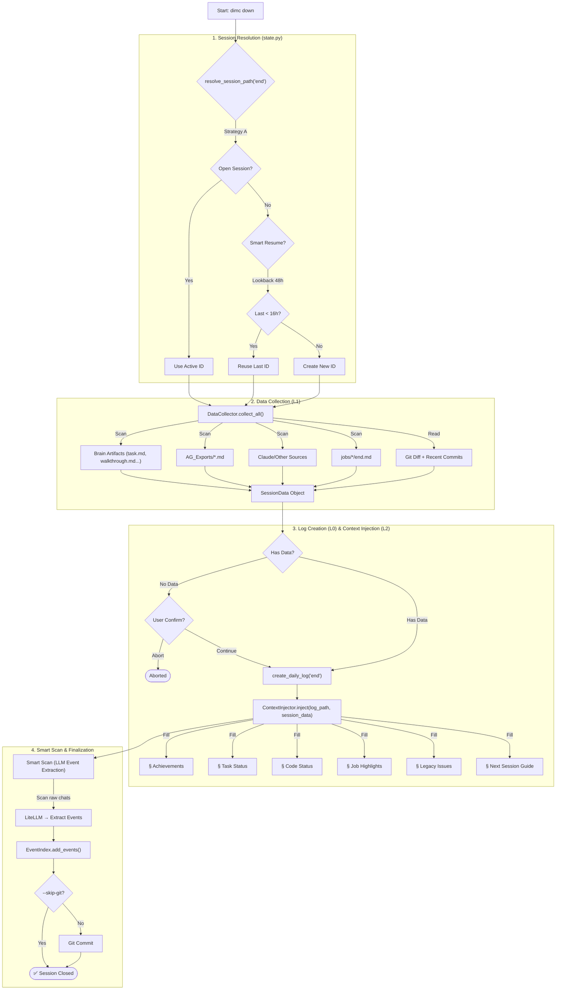

# dimc down 流程逻辑说明书

> **最后更新**: 2026-02-19 (对齐 `SessionEndService` 实际实现)  
> **代码入口**: `cli.py::down()` → `core/session_end.py::SessionEndService`

本文档描述了 `dimc down` 命令的完整执行逻辑，包括 **Session Resolution**、**DataCollector (L1)**、**ContextInjector (L2)** 和 **Smart Scan** 机制。

## 流程图 (Flowchart)

## 核心逻辑详解

### 1. 会话判定机制 (Smart Resume)

代码: `core/state.py::resolve_session_path("end")`

1.  **Strategy A — 活跃会话优先 (Active Session)**:
    - `get_active_session()` 检查是否存在未闭合的会话（有 `XX-start.md` 但没有对应 `end.md`）。
    - 如果存在，直接使用该会话 ID。

2.  **Strategy B — 智能续接 (Smart Resume)**:
    - `get_last_session(lookback_days=2)` 回溯 48 小时。
    - 如果最近一次 session 启动距今 < 16小时，复用该 ID。
    - **用途**: 跨午夜工作时，不会创建"新一天的会话"。

3.  **Strategy C — 兜底新建 (Fallback)**:
    - 在今天的目录下用 `get_next_hex_seq()` 创建新 session ID。

### 2. 数据采集 (L1 — DataCollector)

代码: `core/data_collector.py::DataCollector`

`SessionEndService` 在创建日志前**先采集数据**，结果封装为 `SessionData` 对象：

| 数据源 | 采集方式 | 内容 |
|:--|:--|:--|
| Brain Artifacts | 扫描 `brain_dir` 下活跃对话目录 | `task.md`, `walkthrough.md`, `implementation_plan.md` |
| Raw Chats | 扫描 `AG_Exports/` 目录 | 导出的 Agent 对话原文 (Markdown) |
| External Files | 扫描 `claude/` 等配置的外部目录 | 第三方 AI 工具导出 |
| Job Logs | 扫描 `docs/logs/YYYY/MM-DD/jobs/` | Sub-agent 任务的 `end.md` |
| Git Context | `git diff --stat` + `git log --oneline` | 代码变更和最近提交 |

> **关键变化 (vs 老版本)**: 数据采集是 `SessionEndService` 的**第一步**（早于日志创建），而非在 ContextInjector 内部懒加载。

### 3. 上下文注入 (L2 — ContextInjector)

代码: `audit/context_injector.py::ContextInjector`

注入器接收 `SessionData` 和 `log_path`，填充 `end.md` 各章节：

| SessionData 字段 | 注入目标章节 | 逻辑 |
|:--|:--|:--|
| `brain_artifacts` (task.md) | `## 📅 今日成果` | 提取 `[x]` 完成项 |
| `brain_artifacts` (walkthrough) | `## 📅 今日成果` | 验证总结 |
| `raw_chat_files` | `## 📅 今日成果` | 匹配 session 的对话标题 |
| `brain_artifacts` (task.md) | `## 🔴 未完任务` | 提取 `[ ]` 未完成项 |
| STATUS.md | `## ⭐ 代码现状` | 版本状态表 |
| `job_summaries` | `## 🧩 任务详情` | Sub-agent job 高亮 |
| `brain_artifacts` (impl_plan) | `## 🧱 遗留问题` | Legacy Issues 章节 |
| `brain_artifacts` (impl_plan/task) | `## 🚀 明日开工指南` | Next Steps + 待办 |

### 4. Smart Scan (LLM 事件提取)

代码: `core/session_end.py::SessionEndService.run_smart_scan()`

从 Raw Chat 文件中用 LLM 提取结构化事件：

1. 遍历 `session_data.raw_chat_files`
2. 对每个文件调用 `LiteLLMClient` 提取 JSON 格式事件
3. 事件写入 `EventIndex` (SQLite)
4. 失败时 soft-fail（打印警告但不中断流程）

### 5. 终结 (Finalization)

代码: `core/session_end.py::SessionEndService.finalize()`

1. `update_index()` — 更新 Markdown 索引
2. `git add` + `git commit` — 自动提交（可通过 `--skip-git` 跳过）

### 6. 数据一致性保障

`ContextInjector` 实现**幂等性 (Idempotency)**：
- 使用正则精确匹配章节头（Header）
- 替换时覆盖旧章节内容，而非追加
- 多次运行 `dimc down` 不会导致内容重复

### 7. 设计缺陷与已知问题

| 问题 | 状态 | 说明 |
|:--|:--|:--|
| Smart Scan JSON 截断 | ⚠️ 已知 | LLM 返回的 JSON 有时过长被截断，导致 `Failed to parse JSON` |
| `resolve_session_path` 副作用 | ⚠️ 已知 | `kind="end"` 的 Strategy C 会 `touch` 空文件占位 seq |
| L3/L4 未实现 | 📋 计划中 | L3 (Timeline 生成) + L4 (因果推理 on end.md) 尚未集成 |
