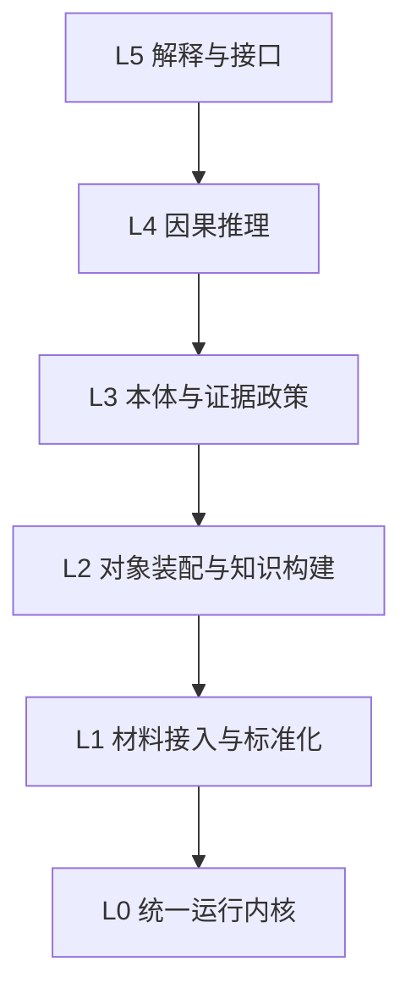

# DIMCAUSE 项目架构规格（Project Architecture）

> **文档ID**: `ARCH-002`
> **版本**: `Draft v1 (2026-03-10)`
> **状态**: `Draft`
> **范围**: 产品级系统架构，不包含 workspace/default profile 映射，也不包含当前仓库内部开发流程规则。

## 文档定位

1. 本文定义 DIMCAUSE 的产品级系统架构，回答系统的核心层次、核心对象、运行模型和解释接口如何协同工作。
2. 本文不描述任何当前 workspace 的目录布局、日志路径、数据库文件名、临时目录或仓库治理规则。
3. 本文不把任何当前项目内部开发流程与治理规则写成产品架构的一部分。
4. 本文与存储架构、对象模型、证据政策互相配合：
   - 项目架构回答“系统如何分层、如何运行、如何解释”；
   - 存储架构回答“不同职责的数据应落在哪一层”；
   - 对象模型回答“系统中有哪些一等对象”；
   - 证据政策回答“系统如何判断证据覆盖与关系确定性”。

## 产品定义

DIMCAUSE 是一套**面向本地异构材料的证据驱动因果调查系统**。

它的目标不是提供通用聊天问答，也不是充当通用知识库、通用 RAG 平台、AI SRE 平台或通用任务调度器。它的目标是：

1. 接收任意本地材料集合；
2. 将材料提升为结构化对象；
3. 在对象之间生成、验证和追踪因果关系；
4. 输出带证据等级、缺失证据说明和可回放链路的调查结论。

## 核心设计原则

1. **Run First**：统一运行单位是 `Run`，不是 `Task`。
2. **Material-Agnostic**：输入可以是代码、文档、日志、聊天导出、报告、会议纪要或其他本地材料，不预设材料一定来自开发流程。
3. **Object-Centered**：因果关系建立在对象网络上，而不是直接建立在原始 chunk 或文件之间。
4. **Evidence-Backed**：任何重要结论都必须能回到证据，不允许只给无法追溯的答案。
5. **Ontology-Constrained**：对象类型、关系类型、证据等级与合法性边界必须受统一约束。
6. **Local-First but Not Repo-Bound**：系统面向本地优先，但不绑定某个仓库的目录习惯或开发工作流。
7. **Derived Indexes Are Disposable**：检索和遍历加速结构是派生层，不承担唯一真理源职责。
8. **Deterministic Precision Retrieval**：系统必须保留非语义、可验证、低幻觉的精确召回通道，作为 semantic、graph 与其他召回机制之外的基础检索支柱；在工程 profile 中，这条通道通常体现为 UNIX-native retrieval。

## 六层系统全景

## Layer 0：统一运行内核（Runtime Kernel）

### 核心职责

Layer 0 统一管理系统中的所有运行实例。它回答的是“系统如何运行”，而不是“材料中有什么结论”。

### 关键运行合同

1. `Run` 作为统一运行单位
2. `RunSpec`、`RunState`、`RunInput`、`RunArtifact`、`ExecutionContext` 作为运行合同与运行状态支持结构

### 负责什么

1. 创建、启动、暂停、恢复、停止和清理运行；
2. 维护运行状态机和状态迁移；
3. 维护输入、输出和工件绑定；
4. 维护资源上下文，例如工作空间、进程、缓存或其他执行环境；
5. 执行运行期策略、权限和恢复机制；
6. 提供 inspect、resume、cleanup、archive 等统一运维能力。

### 支持的典型 run type

1. `investigation_run`
2. `dev_execution_run`
3. `ingestion_run`
4. `index_build_run`
5. `audit_run`
6. `watcher_run`
7. `report_run`

### 关键边界

1. `Run` 不是 `Task`。`Task` 是被调查世界中的工作对象，`Run` 是系统自己的执行单位。
2. Layer 0 不负责判断哪条因果关系成立。
3. Layer 0 不负责定义对象类型和关系类型。
4. Layer 0 不负责最终解释内容生成。

## Layer 1：材料接入与标准化（Material Ingestion）

### 核心职责

Layer 1 接收原始材料，并将其标准化为可计算输入。

### 关键材料合同

1. `Material`
2. `MaterialVersion`
3. `MaterialChunk` 与 `SourceSet` 作为材料处理合同和范围绑定结构

### 输入材料类型

1. 代码与配置
2. 文档与报告
3. 聊天导出与讨论记录
4. 日志与运行记录
5. 会议纪要
6. 票据、审查、检查和结果附件
7. 其他本地文本或结构化材料

### 负责什么

1. 材料导入与来源登记；
2. 版本与快照边界识别；
3. 基础分块与标准化；
4. 时间锚、来源锚和基础元信息提取；
5. 将原始材料送入对象装配与后续推理链。

### 关键边界

1. Layer 1 处理的是“材料可计算化”，不是最终对象关系判断。
2. Layer 1 不应把当前某个 workspace 的目录结构误当作产品输入规范。
3. Layer 1 不应假设输入总是代码仓库或总有 `STATUS`/任务卡存在。

## Layer 2：对象装配与知识构建（Object Assembly & Knowledge Build）

### 核心职责

Layer 2 将材料提升为结构化对象，并建立对象之间的最小关系网络，为因果推理和解释提供知识基础。

### 一等对象家族

1. `Entity`
2. `Event`
3. `Decision`
4. `Claim`
5. `Task`
6. `Symbol`
7. `Artifact`
8. `Check`
9. `Result`
10. `Relation`

### 负责什么

1. 对象抽取与归一化；
2. 对象稳定身份建立；
3. 对象与材料、版本、证据的绑定；
4. 命题与关系候选的结构化表达；
5. 关系状态与等级的知识化表示；
6. 为解释层提供可查询对象图。

### 关键边界

1. `Event` 很重要，但不是唯一业务实体。
2. `Claim` 不等于 `Relation`；前者是命题，后者是结构化边。
3. `Artifact` 不等于 Evidence Layer 中的 `Generated Evidence Artifacts`；前者是对象层工件，后者是证据层工件。
4. Layer 2 产生的是结构化知识对象，不是纯检索缓存。

## Layer 3：本体与证据政策（Ontology & Evidence Policy）

### 核心职责

Layer 3 定义系统允许存在的对象、关系、证据等级和合法性约束，是整个系统的语义和判断边界层。

### 负责什么

1. 定义对象类型与关系类型；
2. 定义关系的 domain/range 与合法性；
3. 定义证据覆盖等级和关系确定性等级；
4. 定义缺失证据、冲突证据和等级历史的表达原则；
5. 为不同领域 profile 提供可扩展但受约束的语义内核。

### 产品级判断语义

Layer 3 至少约束两组等级：

1. `E1-E4`：证据覆盖等级
2. `C0-C4`：关系确定性等级

其中：

1. `E` 回答“当前证据面有多完整”；
2. `C` 回答“在这些证据下，这条关系有多能成立”；
3. 两组等级必须同时展示，且保留历史；
4. 缺失证据与反证不能只作为解释层临时文案，它们必须进入产品语义。

### 关键边界

1. Layer 3 不是只有 ontology 文件。
2. Layer 3 也不是实现层的评分脚本。
3. 它必须同时约束类型系统、关系系统和证据政策。

## Layer 4：因果推理（Causal Reasoning）

### 核心职责

Layer 4 在对象网络上构造、验证、排序和解释因果关系。

### 输入来源

1. 时间锚和版本演化；
2. 显式因果陈述；
3. 对象共现和对象重叠；
4. 结构依赖和符号锚点；
5. 过程对象、验证对象与结果对象的链接（工程 profile 中常见为 `Task / Run / Check / Result`）；
6. 冲突证据与反证；
7. 证据历史与关系状态历史。

### 输出

1. 关系候选；
2. 被支持关系；
3. 被确认关系；
4. 被否决关系；
5. 缺失证据说明；
6. 可回放的因果路径；
7. 面向解释层的证据化结论。

### 核心要求

1. Layer 4 不能退化成纯相似度或纯时间邻近计算。
2. Layer 4 必须在对象层和证据政策约束下工作。
3. 当前状态只是投影，关系状态和等级历史必须可回放。

## Layer 5：解释与接口（Explanation & Interfaces）

### 核心职责

Layer 5 把结构化对象、因果关系和证据链变成用户可以消费的接口与结果。

### 主要接口

1. `search`
2. `why`
3. `trace`
4. `inspect`
5. `report`
6. `explore`

### 第一等输出

1. 调查报告；
2. 局部因果链；
3. 证据包；
4. 缺失证据说明；
5. 对象视图；
6. 关系分级视图。

### 核心要求

1. Layer 5 不应重新发明一套数据模型。
2. Layer 5 必须直接消费对象、关系、证据和等级。
3. 聊天问答可以存在，但不是系统唯一也不是系统最重要的输出形态。
4. `search`、`why`、`trace` 不得只依赖语义召回；系统必须保留确定性精确召回通道，确保函数名、路径、错误码、精确字符串等查询能够以低幻觉方式命中证据。

## 核心主链

DIMCAUSE 的产品主链应被固定为：

这条主链意味着：

1. 检索只是进入主链的一步，不是系统定义本身；
2. 对象化是因果调查的前提；
3. 等级与证据绑定是解释可信度的核心；
4. 解释层必须回到证据，而不是只输出结论。
5. 主链中的检索既包括语义与结构召回，也包括确定性精确召回；后者不是实现偶然性，而是产品正确性的一部分。
5. 主链中的检索既包括语义与结构召回，也包括确定性精确召回；后者不是实现偶然性，而是产品正确性的一部分。

## 通用内核与领域 Profile

### 通用内核

产品通用内核必须固定以下内容：

1. `Run` 作为统一运行单位；
2. `Material -> Object -> Relation Candidate -> Validation -> Explanation` 主链；
3. 多对象并存的知识模型；
4. `Evidence / Runtime / Knowledge / Derived Index` 四层分离；
5. `E` / `C` 双轴等级；
6. 缺失证据、反证与历史保留原则。

### 领域 Profile

领域 profile 只能细化：

1. 对象子类型；
2. 关系子类型；
3. 提取策略；
4. 证据权重与证据政策细则；
5. 解释模板。

领域 profile 不得重新定义：

1. 运行底座；
2. 四层存储职责；
3. 是否保留历史；
4. 是否需要证据化解释。

## 与存储架构的关系

项目架构只回答系统如何分层运行，不回答具体物理后端如何落盘。

存储层的正式职责应由存储架构文档进一步定义，但本架构固定以下关系：

1. **Evidence Layer**：保存原始证据与可审计工件；
2. **Runtime Layer**：保存运行中和高频变化的状态；
3. **Knowledge Layer**：保存结构化对象、关系、等级与历史；
4. **Derived Index Layer**：保存可重建索引与加速结构。

## 本文明确不做什么

1. 不定义当前 workspace 的目录布局；
2. 不定义当前仓库的开发流程和治理规则；
3. 不定义数据库表结构、目录结构或 ID 编码规范；
4. 不把当前实现状态、当前审计差异和历史迁移笔记混入架构正文；
5. 不把系统重新定义成通用知识库、通用 RAG 或 AI SRE 平台。

## 当前结论

1. DIMCAUSE 的产品架构应围绕“统一运行底座 + 通用材料对象化 + 证据化因果推理 + 可解释接口”建立，而不是围绕某个开发仓库工作流或单一数据源建立。
2. `Run-centric runtime kernel`、`multi-object knowledge model`、`ontology + evidence policy` 和 `four-layer storage separation` 是后续正式存储架构和实现迁移的不可绕开约束。
3. 这份文档应作为正式架构重写的第一版基础；后续正式存储架构文档应与它保持严格一致，而不是反向把当前实现细节写回这里。
