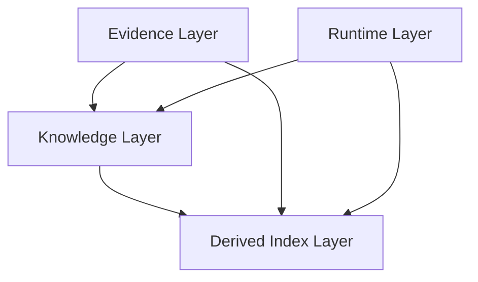

# DIMCAUSE 存储架构技术规范

> **文档ID**: `ARCH-003`
> **版本**: `v1.0 (2026-03-19)`
> **状态**: `正式有效`
> **范围**: 产品级存储架构，不包含 workspace/default profile 映射，也不包含当前仓库内部开发流程规则。

## 文档定位

1. 本文定义 DIMCAUSE 的产品级存储架构，回答系统中的不同数据为什么必须分层、各层各自承担什么职责、它们如何协同支撑证据驱动因果调查。
2. 本文不描述任何当前 workspace 的目录布局、日志路径、数据库文件名、缓存路径、临时目录或仓库治理规则。
3. 本文不把任何当前项目内部开发流程与治理规则写成存储架构的一部分。
4. 本文与以下上位文档协同：
   - 项目架构回答“系统如何分层、如何运行、如何解释”；
   - 核心对象模型回答“系统中有哪些一等对象”；
   - 证据政策回答“系统如何判断证据覆盖与关系确定性”；
   - 存储架构回答“不同职责的数据应落在哪一层，以及它们为何不能混放”。
5. 自 `2026-03-19` 起，本文是当前仓库中**唯一正式有效**的存储架构入口；`docs/PROPOSALS/STORAGE_ARCHITECTURE_DRAFT_V1.md` 仅保留为历史设计记录，不再承担第一层正式真理源职责。

## 存储架构的目标

DIMCAUSE 是一套面向本地异构材料的证据驱动因果调查系统。存储架构必须服务于以下目标：

1. 保存原始材料和可审计工件，使调查结论可以回到证据；
2. 支撑统一运行内核，使不同类型的 run 可以被创建、恢复、检查和清理；
3. 保存结构化对象、关系、等级和历史，使因果判断具有稳定对象语义；
4. 允许构建可重建的索引层，以提升召回、遍历和查询性能；
5. 明确真理源、运行态和派生层的边界，防止实现把缓存、索引或当前状态误当成事实本体。

## 核心设计原则

1. **Storage by Responsibility**：按职责分层，而不是按当前介质、当前目录或当前实现习惯分层。
2. **Evidence First**：凡是需要被引用、被审计、被回放的材料和工件，都必须有稳定证据语义。
3. **Runtime Is Not Knowledge**：运行状态回答“系统现在怎么跑”，不能替代长期知识真理源。
4. **Knowledge Is Not Raw Material**：结构化对象、关系、等级和历史是系统建模结果，不应与原始材料副本混淆。
5. **Derived Indexes Are Rebuildable**：向量、全文、遍历优化和缓存是派生层，不承担唯一真理源职责。
6. **Object-Centered Storage**：存储架构必须为多对象模型服务，不再围绕单一 `Event` 实体展开。
7. **Local-First but Not Repo-Bound**：产品可以默认 local-first，但存储职责不绑定某个 repo 的路径习惯。
8. **History Must Survive**：关系状态历史、等级历史和关键 provenance 必须可回放，当前状态只能是投影。

## 四层存储模型

## Layer 1：Evidence Layer

### 定义

Evidence Layer 保存原始证据和可审计工件，是系统回答“依据是什么”的长期证据层。

### 子类

Evidence Layer 至少包含两类证据载体：

1. `Source Materials`
2. `Generated Evidence Artifacts`

### Source Materials

`Source Materials` 指原始导入材料、原始文件及其版本快照、外部导出、输入快照等。它们代表外部世界进入系统时的证据事实。

其核心语义：

1. provenance 来自外部材料源、导入批次、采集时间和快照边界；
2. 版本语义围绕材料本身的变化定义，而不是围绕后续解释结论定义；
3. 后续解释、报告和因果链必须能够稳定引用到具体材料、具体版本和具体片段。

### Generated Evidence Artifacts

`Generated Evidence Artifacts` 指报告、检查结果、调查附件、引用工件、回放工件等系统生成的证据化产物。

其核心语义：

1. provenance 来自生成它的 run、生成时间、输入范围、生成策略和必要的人类确认；
2. 生命周期共享 Evidence 的长期保留语义，因为这些工件本身会成为后续调查证据；
3. 版本语义围绕“哪次运行生成、是否被修订、修订依据是什么”定义，而不是沿用原始材料版本号。

### 应存内容

1. 原始材料与材料快照；
2. 外部导出的原始文件；
3. 报告、检查结果、审计附件、引用工件；
4. 可回放的证据片段和附件；
5. 与证据相关的稳定 provenance 元数据。

### 不应存内容

1. 活跃运行状态；
2. 锁、进程句柄、恢复点；
3. 仅为性能服务的缓存；
4. 仅为召回服务的派生索引结构。

### 可变性与真理源地位

1. Evidence 倾向不可变或追加式写入；
2. 允许补充元数据和新增版本，但不应被设计成随时覆盖的状态表；
3. Evidence 是“证据世界”的真理源之一，后续解释必须能够回到这一层。

### 生命周期

1. 默认长期保留；
2. 默认可归档、可审计、可回放；
3. 清理策略应比 Runtime 更保守。

### 对外语义

Evidence Layer 回答的是：

- 你依据了什么；
- 这些依据来自哪里；
- 它们在什么时间、什么版本、什么运行中被纳入调查。

## Layer 2：Runtime Layer

### 定义

Runtime Layer 保存可变运行状态，是系统回答“当前如何运行、能否恢复、为何失败”的控制层。

### 应存内容

1. `Run`、`RunSpec`、`RunState`；
2. 状态迁移记录；
3. 活跃执行上下文；
4. 资源绑定、恢复点、生命周期标记；
5. inspect / resume / cleanup 所需状态；
6. 输入输出与工件的运行时绑定。

### 不应存内容

1. 长期知识真理；
2. 原始证据主副本；
3. 最终调查报告的唯一引用版本；
4. 仅为性能存在的派生索引。

### 可变性与真理源地位

1. Runtime 是高频更新、并发敏感、状态机驱动的数据层；
2. 它是“当前系统如何运行”的真理源；
3. 它不是“世界上发生了什么”的最终真理源。

### 生命周期

1. 与 run 生命周期强绑定；
2. 活跃状态短寿；
3. 历史状态可以保留摘要以服务恢复和审计，但不应替代 Evidence 或 Knowledge。

### 对外语义

Runtime Layer 回答的是：

- 现在有哪些 run 在运行；
- 它们处于什么状态；
- 是否可以恢复；
- 为什么失败；
- 如何清理。

## Layer 3：Knowledge Layer

### 定义

Knowledge Layer 保存结构化对象、关系、证据绑定、等级与历史，是系统回答“系统当前认为哪些对象与关系成立，以及为什么”的主语义层。

### 应存内容

1. 一等对象及其稳定标识；
2. 对象属性与对象间关系；
3. 显式关系、候选关系、验证后关系、被否决关系；
4. 对象到证据的绑定；
5. 对象到运行的桥接；
6. 关系状态、关系状态历史；
7. 证据覆盖等级与关系确定性等级；
8. 缺失证据、冲突证据、解释元数据。

### 不应存内容

1. 原始材料全文及其主副本；
2. 活跃运行状态、锁和恢复点；
3. 仅为加速而存在的向量、FTS 或 traversal cache。

### 多对象约束

Knowledge Layer 服务于多对象模型，而不是单一 `Event` 模型。`Event` 很重要，但它不是唯一业务实体。

### 关系与历史约束

1. `Claim` 不等于 `Relation`；
2. `Artifact` 不等于 Evidence Layer 的 `Generated Evidence Artifacts`；
3. 候选关系、被支持关系、被确认关系、被否决关系都必须能持久表达；
4. 关系状态历史必须可回放；
5. 当前状态和当前等级只能是某一时点上的投影，不得成为唯一记录。

### 可变性与真理源地位

1. Knowledge 允许演化，但对象身份与关系历史必须稳定可追溯；
2. 它是“系统对材料世界的结构化建模”的真理源；
3. 它不能退化成缓存，也不能退化成临时结果表。

### 生命周期

1. 通常长于 Runtime；
2. 会随新证据与新运行演化；
3. 不应因索引重建而消失。

### 对外语义

Knowledge Layer 回答的是：

- 系统认出了哪些对象；
- 对象之间有哪些关系；
- 这些关系的当前等级是什么；
- 这些判断依据了什么、缺了什么、与什么冲突。

## Layer 4：Derived Index Layer

### 定义

Derived Index Layer 保存可重建的索引与加速结构，是系统回答“如何更快地找到和遍历”的派生层。

### 应存内容

1. 向量索引；
2. 全文索引；
3. 图遍历优化结构；
4. 代码与符号索引；
5. 查询缓存与排序辅助结构；
6. 明确标记为可重建的派生结构。

### 不应存内容

1. 唯一的对象真理记录；
2. 唯一的关系真理记录；
3. 唯一的原始材料主本；
4. 唯一的运行状态主本。

### 可变性与真理源地位

1. Derived Index 允许失效、替换、清空、重建；
2. 它不是产品真理源；
3. 它是性能与召回增强层。

### 生命周期

1. 由重建策略与性能需求决定；
2. 可以短于其他三层；
3. 必须允许在不损失产品真理源的前提下被重建。

### 对外语义

Derived Index Layer 回答的是：

- 怎样更快地找到；
- 怎样更快地遍历；
- 怎样更高效地召回；

它不回答：

- 什么是真实证据；
- 哪条关系成立；
- 哪个 run 是当前真相。

## 层间数据流

### 导入

1. 材料首先进入 Evidence 形成可引用证据载体；
2. Runtime 记录这次导入 run 的状态；
3. Knowledge 从材料中抽取对象与关系；
4. Derived Index 为后续检索和遍历建立可重建索引。

### 调查

1. 调查 run 在 Runtime 中推进；
2. Runtime 读取 Evidence 与 Knowledge；
3. 新的候选关系、验证结果与证据化工件产生后：
   - 可引用工件进入 Evidence；
   - 结构化结论、状态历史和等级进入 Knowledge；
   - 相关索引更新进入 Derived Index。

### 解释

1. 解释接口优先读取 Knowledge 中的对象、关系、等级与历史；
2. 然后回到 Evidence 取具体证据片段和引用工件；
3. Derived Index 只负责帮助召回与遍历，不应单独产出最终结论。

### 重建

1. Derived Index 应能由 Evidence 与 Knowledge 重建；
2. Runtime 不应成为重建 Evidence 或 Knowledge 的唯一来源。

### 清理

1. Runtime 可以在 run 完结后主动收缩；
2. Derived Index 可以按重建策略淘汰；
3. Evidence 与 Knowledge 的清理更保守，必须受保留策略约束。

## 写入边界

| 层 | 主要写入者 | 主要写入内容 | 不应承担的职责 |
| --- | --- | --- | --- |
| Evidence | 导入器、报告生成器、检查器、人工补充流程 | 原始材料、快照、证据工件、报告、附件 | 活跃 run 状态、纯性能缓存 |
| Runtime | Runtime kernel、调度与恢复逻辑 | run 创建、状态迁移、恢复点、资源绑定 | 长期知识真理、最终证据档案 |
| Knowledge | 抽取器、验证器、推理器、人工校正流程 | 对象、关系、等级、等级历史、证据绑定、缺失与冲突表达 | 原始材料主副本、纯性能索引 |
| Derived Index | 索引器、重建任务 | 向量、FTS、遍历优化、查询缓存 | 唯一事实来源 |

## 产品架构、workspace profile、当前项目开发流程的边界

### 产品架构

本文回答的是：

1. 产品为什么需要四层分离；
2. 每层应存什么、不应存什么；
3. 每层的真理源地位、可变性、生命周期和对外语义是什么；
4. 四层如何共同服务证据驱动因果调查主链。

### workspace/default profile

后续 `workspace profile` 文档才负责回答：

1. 某个默认本地部署如何把四层映射到具体目录、数据库、对象存储和索引介质；
2. 默认 artifact layout、默认 source roots、默认保留策略是什么；
3. 哪些路径只是某个 profile 的实现细节。

### 当前项目内部开发流程

当前项目内部开发流程与治理规则只回答：

1. 分支纪律与合流门禁；
2. 预写入检查；
3. 受保护文档门禁；
4. worktree / session 纪律；
5. 格式化策略。

这些都不属于产品存储架构本体。

## 迁移原则

1. **先定义，再映射**：先固定四层职责与边界，再定义 default profile，最后才处理具体 workspace 的现实映射。
2. **先语义，再介质**：先确定对象、关系、证据、run 和索引的存储语义，再讨论 SQLite、文件系统、对象存储或图数据库等具体实现。
3. **先分真理源，再谈重建**：先说清哪些层不可替代、哪些层可重建，才能谈备份、恢复、缓存与重建任务。
4. **先切边界，再谈治理**：产品存储架构定完之后，workspace/default profile 和仓库开发规则再分别成文，不应继续混写。

## 当前明确不做什么

1. 本文不把任何具体 workspace 的路径、目录、文件名当作产品级四层定义。
2. 本文不把任何仓库治理门禁、起草流程纪律或开发规则混入产品存储架构本体。
3. 本文不冻结具体物理后端、具体表结构、具体 ID 编码规则；这些需要对象模型、证据策略和 profile 文档继续收口。
4. 本文不把产品重新定义成 AI SRE、通用 RAG、通用知识库或通用调度器。

## 与其他上位文档的关系

1. `PROJECT_ARCHITECTURE.md` 定义系统整体层次和运行/解释主链；
2. 本文定义四层存储职责与边界；
3. `CORE_OBJECT_MODEL_V1.md` 定义一等对象家族及其最低归属；
4. `EVIDENCE_POLICY_AND_CAUSALITY_GRADES_V1.md` 定义证据覆盖等级与关系确定性等级。

这四份文档必须共同演化，但职责不能互相替代。
