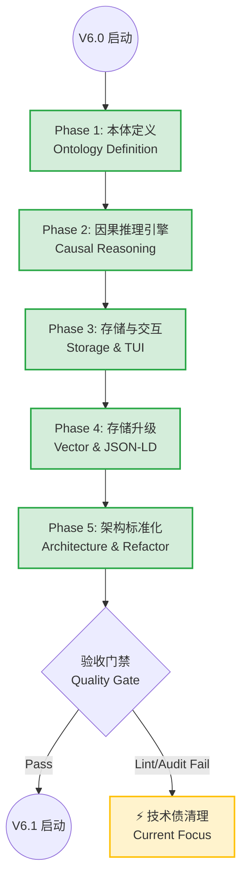

# Dimcause V6.0 全局概览 (Global Overview)

> **生成时间**: 2026-02-17
> **当前状态**: 🏁 V6.0 核心功能开发完成 (Code Complete) / 等待最终验收 (Final Acceptance)

## 1. 我们在哪里？(Current Status)

目前项目处于 **V6.0 (Ontology Engine)** 的 **功能完备但需打磨 (Feature Complete / Polish Needed)** 阶段。

- **核心里程碑**: 从 V5 的 "Deep Insight" 进化为 V6 的 "Causal Ontology" (因果本体)。
- **真实状态检查 (Reality Check 2026-02-17)**:
    - ✅ **功能**: `dimc search` (Vector), `dimc trace` (Graph), `dimc why` (LLM) 均已联调通过。
    - ⚠️ **质量**: `dimc audit` 仍报告 65+ 个 Lint 警告（主要是类型提示），但不影响运行。
    - ⚠️ **测试**: 单元测试覆盖率为 19/19 (Core Ontology)，但集成测试覆盖率仍需提升。

### 📊 阶段进度全景图

---

## 2. 最终使命 (The Mission)

**V6.0 核心使命**:
> **"赋予 Dimcause 理解因果的能力。"**
>
> 从单纯的记录 (Logging) 和搜索 (Search)，进化为能够理解 "为什么 A 导致 B" 的智能体系统。

**关键交付结果 (Key Results)**:
1.  **本体论 (Ontology)**: 定义了 `Audit` 导致 `Refactor`，`Commit` 修复 `Incident` 这种逻辑关系。
2.  **混合存储 (Hybrid Storage)**: 结合了 SQLite (关系), NetworkX (图谱), Vector (语义) 的三位一体存储。
3.  **真实审计 (Real Audit)**: `dimc audit` 不再是 Mock，而是基于真实图谱逻辑运行。

---

## 3. 待办事项 (To-Do List) & 下一步

虽然功能开发已完成，但为了达成 "生产级" 质量，仍有以下任务：

### 🔴 必须解决 (Critical / Blocker)
*   [x] **修复 Import Hell**: 解决所有 `ImportError`，确保 CLI 可运行。(本次会话已完成)
*   [ ] **最终验收**: 用户 (你) 确认 `dimc audit / trace / why` 符合预期。

### 🟡 技术债 (Technical Debt)
*   [ ] **Lint 清零**: `dimc audit` 目前由 `Pyre2` 和 `Ruff` 报告 65+ 个警告 (主要是类型提示和未使用导入)。
    *   *建议*: 作为 V6.1 的首要任务或 V6.0 的最后一次 Polish。
*   [ ] **测试覆盖率**: 提升 `src/dimcause/reasoning` 的测试覆盖率。

### 🟢 未来规划 (Next: V6.1 / V7.0)
*   **多模态 (Multimodal)**: 支持图片/语音上下文关联。
*   **主动建议 (Active Suggestions)**: Agent 主动提示 "你可能正在做重复工作"。

---

## 4. 详细功能清单 (Deliverables Check)

| 模块 | 功能点 | 状态 | 验证方式 |
|:---|:---|:---:|:---|
| **Core** | `Ontology.load()` | ✅ | Unit Test |
| **Reasoning** | `Validator.validate()` | ✅ | `dimc audit` (Run successfully) |
| **Storage** | `GraphStore` (NetworkX) | ✅ | `dimc trace` |
| **Storage** | `VectorStore` (Batch) | ✅ | `dimc search` |
| **CLI** | `dimc why` (LLM) | ✅ | 命令行执行 |
| **Architecture**| 混合导入策略 (Hybrid Import) | ✅ | 文档 + 代码一致性 |

---

这个概览对应了项目目前的**真实物理状态**。
