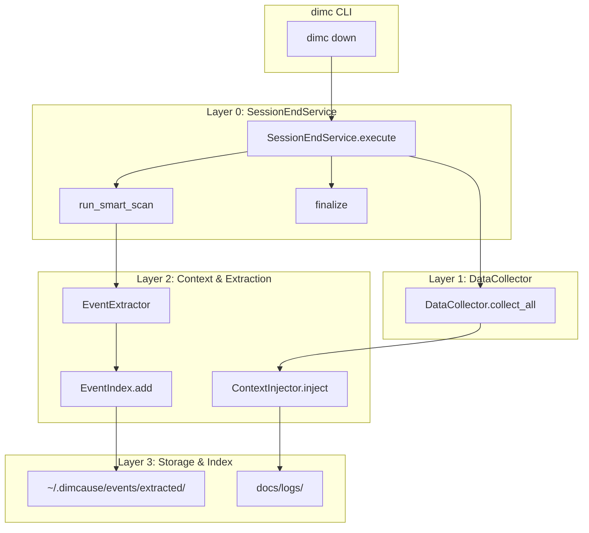
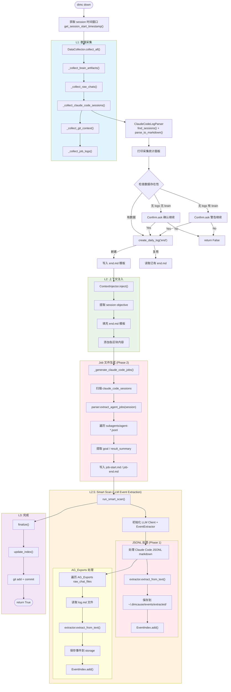
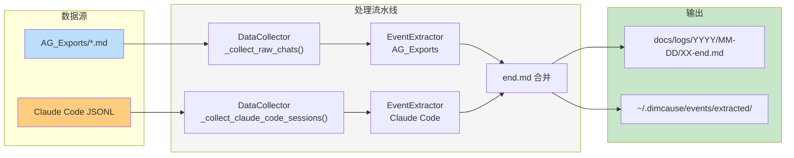
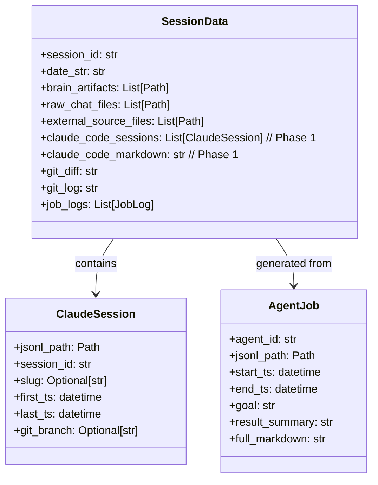
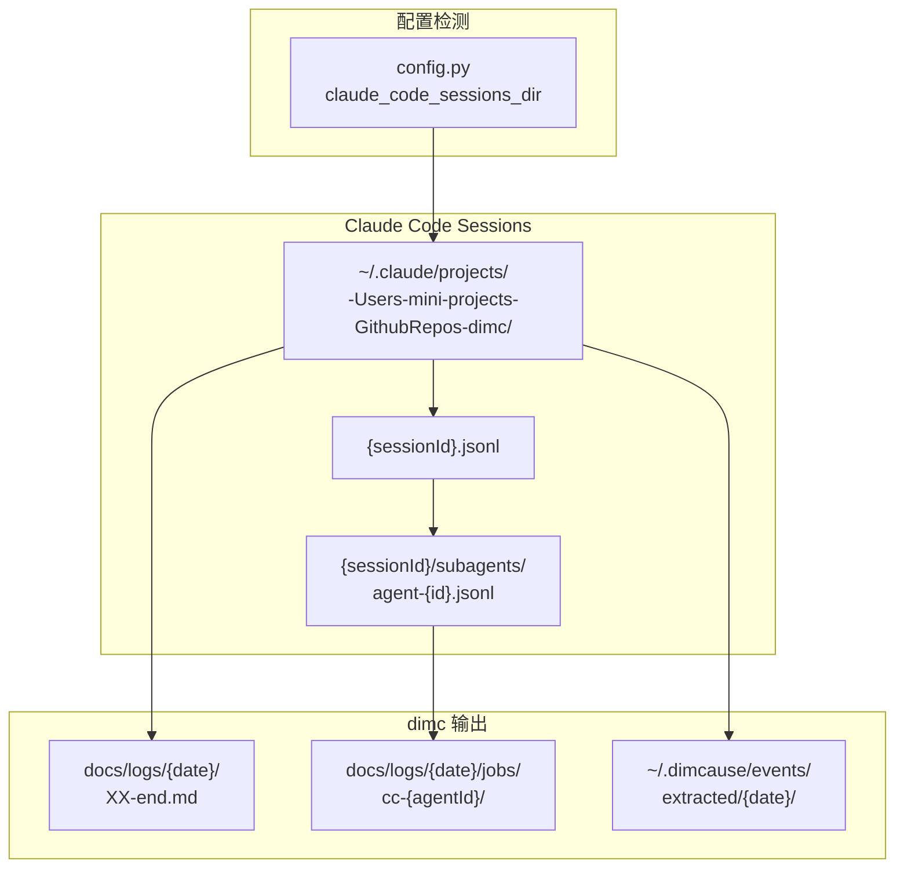
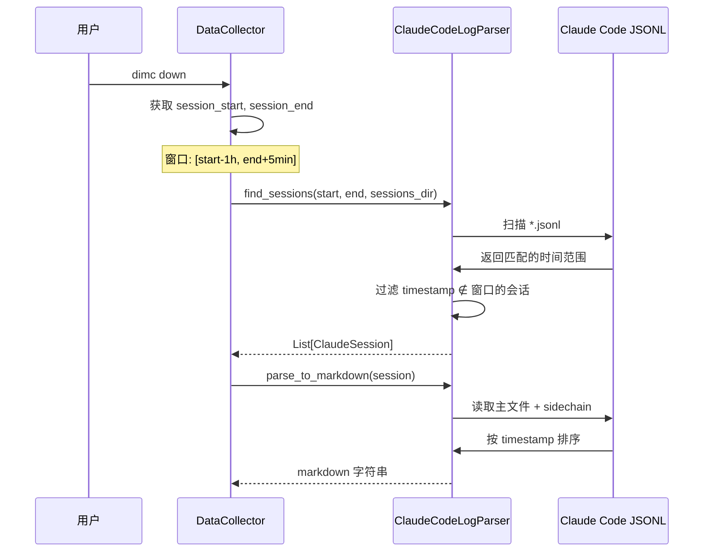
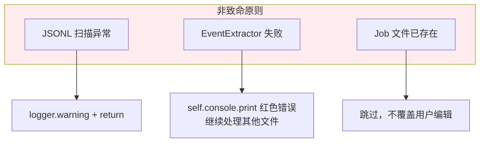
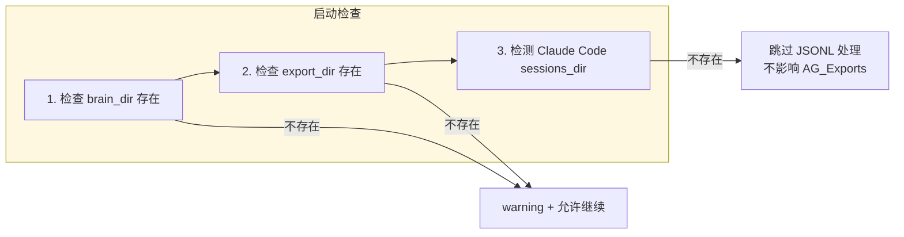

# dimc down 完整流程图

## 整体架构

## 详细流程：dimc down

## 双轨并行：AG_Exports vs Claude Code JSONL

## 数据流：SessionData

## 关键文件位置

## Phase 1 vs Phase 2 功能对比

| 功能 | Phase 1 | Phase 2 |
|------|---------|---------|
| JSONL → markdown | ✅ | ✅ |
| EventExtractor 集成 | ✅ | ✅ |
| 提取 session objective | ✅ | ✅ |
| Subagent job 检测 | - | ✅ |
| 生成 job-start.md | - | ✅ |
| 生成 job-end.md | - | ✅ |

## 时间窗口过滤

## 错误处理原则

## 依赖检查顺序

